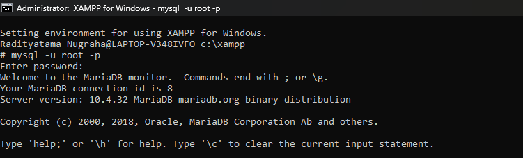
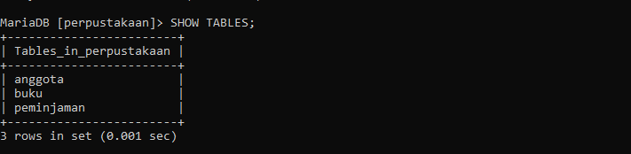
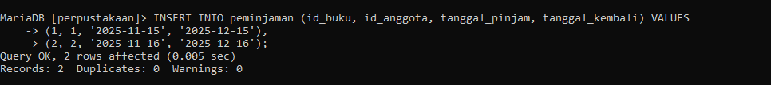

# Tugas Praktikum 7 (Pertemuan ke 9) 

|Nama|NIM|Kelas|Mata Kuliah|
|----|---|-----|------|
|**Radityatama Nugraha**|**312310644**|**TI.23.A3**|**Manajemen Basis Data**|

# Soal 1:

## - Untuk Memulai Codingan Database di XAMPP dan ke Shell

## - Membuat dan memilih database perpustakaan dengan perintah CREATE DATABASE perpustakaan; dan USE perpustakaan;.

## - Membuat tabel buku dalam database perpustakaan dengan perintah CREATE TABLE buku; yang berisi kolom id_buku, judul, penulis, penerbit, tahun_terbit, dan isbn untuk menyimpan data buku secara terstruktur.

## - Membuat tabel anggota dalam database perpustakaan dengan perintah CREATE TABLE anggota; yang berisi kolom id_anggota, nama, alamat, dan no_hp untuk menyimpan data anggota perpustakaan.

## - Membuat tabel peminjaman dalam database perpustakaan dengan perintah CREATE TABLE peminjaman; yang berisi kolom id_pinjam, id_buku, id_anggota, tanggal_pinjam, dan tanggal_kembali, serta relasi ke tabel buku dan anggota menggunakan foreign key.

## - Menampilkan daftar tabel dalam database perpustakaan dengan perintah SHOW TABLES; yang menghasilkan tiga tabel yaitu anggota, buku, dan peminjaman.

## - Menambahkan data ke dalam tabel buku dengan perintah INSERT INTO buku; untuk menyimpan informasi dua buku yaitu Belajar Manajemen Basis Data dan Belajar Kriptografi beserta detail penulis, penerbit, tahun terbit, dan ISBN.

## - Menampilkan seluruh data dari tabel buku dengan perintah SELECT * FROM buku; yang menghasilkan dua baris data berisi informasi judul, penulis, penerbit, tahun terbit, dan ISBN buku.

## - Menambahkan data ke dalam tabel anggota dengan perintah INSERT INTO anggota; untuk menyimpan informasi dua anggota yaitu Radit dan Rifqi beserta alamat dan nomor HP masing-masing.

## - Menampilkan seluruh data dari tabel anggota dengan perintah SELECT * FROM anggota; yang menghasilkan dua baris data berisi informasi nama, alamat, dan nomor HP anggota perpustakaan.

## - Menambahkan data ke dalam tabel peminjaman dengan perintah INSERT INTO peminjaman; untuk mencatat dua transaksi peminjaman buku oleh anggota pada tanggal 15 dan 16 November 2025.

## - Menampilkan seluruh data dari tabel peminjaman dengan perintah SELECT * FROM peminjaman; yang menghasilkan dua baris data berisi informasi peminjaman buku oleh anggota, termasuk tanggal pinjam dan tanggal kembali.

# Soal 2:
## - Pengertian Super Key 
### - Super Key adalah kombinasi atribut yang dapat mengidentifikasi satu baris secara unik di dalam tabel.
## - Contoh Super Key (tabel Buku)
### - Tabel Buku(id_buku, judul, penulis, isbn)
### - {id_buku}
### - {isbn}
### - {id_buku, judul} → tetap unik karena ada id_buku
### - {isbn, penulis}

# Soal 3:
## - Pengertian Candidate Key 
### - Candidate Key adalah super key yang paling minimal (atributnya tidak bisa dikurangi lagi tapi tetap unik).
## - Contoh Candidate Key (tabel Buku)
### - {id_buku}
### - {isbn}

# Soal 4:
## - Pengertian Primary Key 
### - Primary Key adalah candidate key yang dipilih sebagai identitas unik utama dari tabel.
## - Contoh Primary Key (tabel Buku)
### - {id_buku}

# Soal 5:
## - Pengertian Alternatif Key 
### - Alternate Key adalah candidate key yang tidak dipilih menjadi primary key.
## - Contoh Alternatif Key (tabel Buku)
### - {isbn} Karena isbn tetap unik tapi tidak dipilih sebagai primary key.

# Soal 6:
## - Pengertian Foreign Key 
### - Foreign Key adalah atribut yang menghubungkan satu tabel dengan tabel lain, mengacu pada primary key tabel lain.
## - Contoh Foreign Key (tabel Peminjaman)
### Tabel Peminjaman(id_pinjam, id_buku, id_anggota, tanggal_pinjam)
### - id_buku → foreign key ke Buku(id_buku)
### - id_anggota → foreign key ke Anggota(id_anggota)

